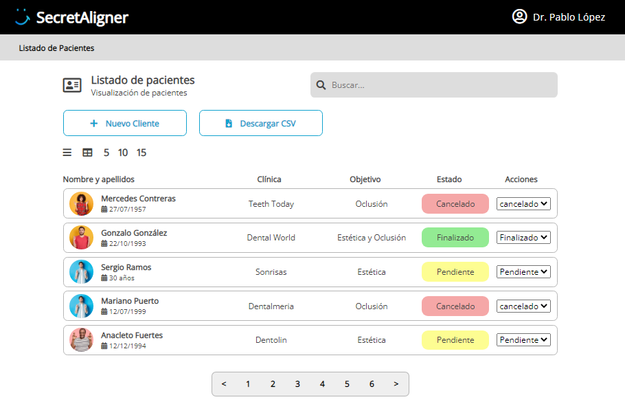

Introducción
-------------
Un dashboard de clientes de una clínica dental desarrollado con Vue3 y Option API para el front, y Firebase en el back con uso de Firestore como base de datos y para el propio hosting del proyecto. Para acceder al proyecto, [pulsa aquí](https://secretaligner-test.web.app/).


<p align="center">
  
  
</p>

Setup 
-------------
```
npm install
```
### Frontend
```
npm run serve
```
### Compilación para producción
```
npm run build
```

Características
-------------
* HTML5, CSS3, JS
* [Vue.js](https://v3.vuejs.org/)
* [Option API](https://v3.vuejs.org/api/options-api)
* [Firestore](https://firebase.google.com/docs/firestore)
* [Firebase Hosting](https://firebase.google.com/docs/hosting)
